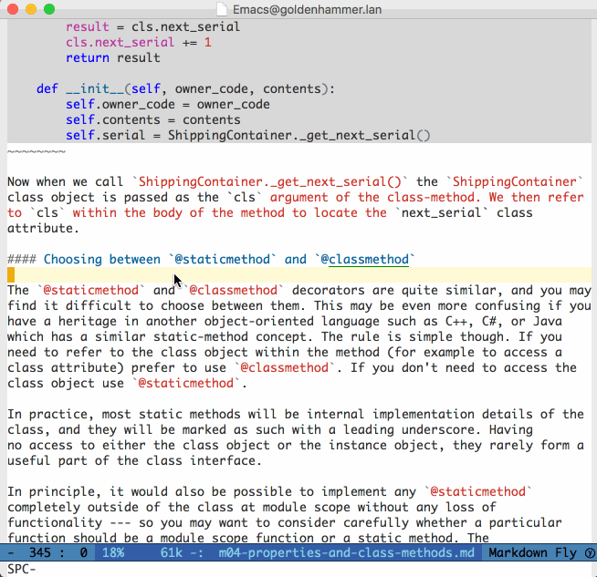

# outline-toc.el

An Emacs extension that will render a "table of contents" for outline-mode
"compatible" buffers (i.e. those that respond to `outline-hide-body`).

This TOC will show the sections in the document, highlighting the one that
you're editing in the master document. The whole idea is to give you context as
you're editing a large document (e.g. a markdown file or something).

## Quickstart

Open up a supported file and run `outline-toc-mode`. This should open up a new
window with a table of contents for your file. As you move around in the source
buffer, the TOC should highlight the section you're in.

Here's an example showing `outline-toc-mode` while editing the markdown source
for a chapter in one of my books:

## Current status

outline-toc works, more or less. You can open up the TOC and it'll stay
synchronized with your master doc. It could certainly use some polish, though.

Right now this is known to work with `markdown-mode`, `org-mode`, and
`outline-mode` files. It may work with others. I'd like it to work with
restructured text, but there seem to be some problems there.

### Caveat emptor, and a call to arms

In my estimation, **this is currently built on a bit of a hack**. `outline-toc`
relies on `outline-hide-body` to show the section headers of documents; it
doesn't bring any extra magic to the mix. Maybe there are better approaches, and
I'm certainly open to ideas, PRs, etc.

Similarly, the "sidebar" buffer is lifted wholesale
from [`minimap`](https://github.com/dengste/minimap). Many Emacs packages
implement similar functionality, and it would be nice if there was a shared
implementation of "sidebars". Maybe this is unrealistic for some reason, but if
someone has a re-usable library for this functionality I'd be eager to try it.
